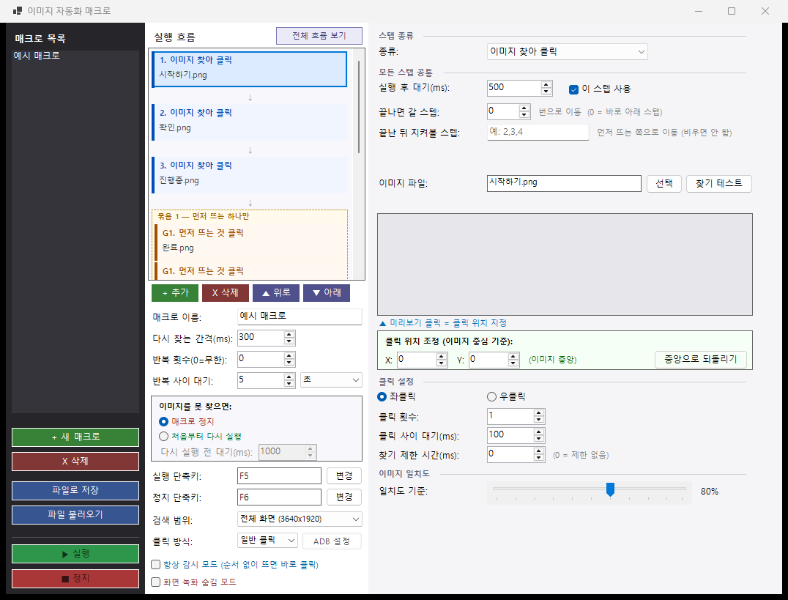
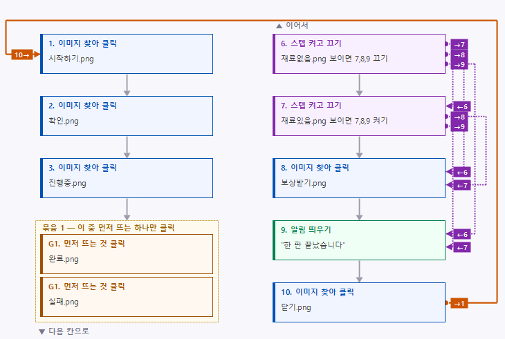
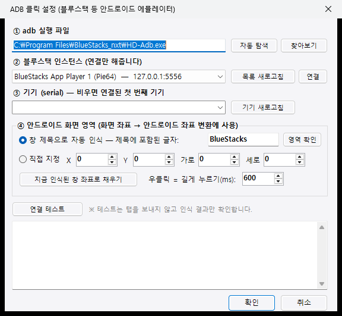

# 이미지 자동화 매크로

화면에서 **이미지를 찾아 클릭**하는 윈도우용 매크로 프로그램입니다.
좌표를 외울 필요 없이, 클릭하고 싶은 버튼을 캡처해 두면 그 버튼이 화면에 뜰 때까지 기다렸다가 눌러줍니다.

다중 모니터(세로 모니터 포함)와 블루스택 같은 안드로이드 에뮬레이터를 지원합니다.



---

## 무엇을 할 수 있나요

- **이미지가 뜰 때까지 기다렸다 클릭** — 로딩 시간이 들쭉날쭉해도 알아서 기다립니다
- **여러 이미지 중 먼저 뜨는 것만 클릭** — "성공" 또는 "실패" 중 뜨는 쪽으로 갈라지는 상황 처리
- **조건 분기 / 반복** — 스텝 사이를 오가며 원하는 흐름을 만들 수 있습니다
- **상황에 따라 구간 건너뛰기** — 특정 이미지가 보이면 일부 스텝을 통째로 끄고, 다른 이미지가 보이면 다시 켭니다
- **다중 모니터** — 전체 화면 또는 특정 모니터만 골라서 검색 (세로로 돌린 모니터도 그대로 인식)
- **커서 없이 클릭** — 마우스 커서를 건드리지 않고 창에 클릭 신호만 보냅니다
- **ADB 클릭** — 블루스택 등 에뮬레이터에 adb로 터치를 보냅니다 (커서 없이 클릭이 안 통하는 게임용)
- **실행 흐름 보기** — 만들어둔 매크로가 어떻게 흘러가는지 그림으로 확인

---

## 내려받기

[**Releases**](../../releases) 에서 `ImageMacro.exe` 를 받아 실행하면 끝입니다.

- **.NET 설치가 필요 없습니다.** 런타임이 exe 안에 들어 있습니다 (약 84MB).
- 첫 실행은 압축을 푸느라 10~20초 걸릴 수 있습니다. 두 번째부터는 빠릅니다.
- 윈도우 SmartScreen 경고가 뜨면 `추가 정보` → `실행` 을 누르세요.
  코드 서명 인증서가 없어서 뜨는 경고입니다.
- 설치 과정이 없습니다. 지우고 싶으면 exe만 삭제하면 됩니다.

> Windows 10 이상 64비트에서 동작합니다.
> ADB 클릭을 쓰려면 블루스택 등 안드로이드 에뮬레이터가 따로 필요합니다.

---

## 처음 써보기

1. **+ 새 매크로** 로 매크로를 하나 만듭니다
2. **+ 추가** 로 스텝을 넣고, 종류를 고릅니다
3. 클릭하고 싶은 버튼을 화면 캡처해서 png로 저장한 뒤 **이미지 파일 → 선택**
4. **찾기 테스트** 로 지금 화면에서 잘 찾는지 확인합니다
5. **F5** 로 실행, **F6** 으로 정지 (단축키는 바꿀 수 있습니다)

> 이미지는 **화면에 보이는 그대로의 크기**로 잘라야 합니다. 확대·축소한 이미지는 찾지 못합니다.
> 잘 못 찾으면 **일치도 기준**을 조금 낮춰보세요 (기본 80%).

---

## 직접 빌드하기

[.NET 9 SDK](https://dotnet.microsoft.com/download/dotnet/9.0) 가 필요합니다.

```bash
git clone https://github.com/sample1285/ImageMacro.git
cd ImageMacro
dotnet run
```

배포용 단일 exe 만들기 (.NET 런타임 포함 — 받는 사람은 아무것도 설치할 필요 없음):

```bash
dotnet publish -c Release -r win-x64 --self-contained true -p:PublishSingleFile=true -p:IncludeNativeLibrariesForSelfExtract=true -p:EnableCompressionInSingleFile=true -o dist
```

`dist/ImageMacro.exe` 하나만 있으면 어디서든 실행됩니다.

`v` 로 시작하는 태그를 올리면 깃헙 Actions 가 알아서 빌드해서 Releases 에 올려줍니다:

```bash
git tag v1.0.0
git push origin v1.0.0
```

---

## 스텝 종류

| 종류 | 하는 일 |
|---|---|
| **이미지 찾아 클릭** | 그 이미지가 화면에 뜰 때까지 기다렸다가, 찾으면 클릭합니다 |
| **여러 이미지 중 먼저 뜨는 것 클릭** | 같은 묶음 번호끼리 한꺼번에 감시하다가 **먼저 보이는 하나만** 클릭하고 나머지는 건너뜁니다 |
| **키보드 입력** | 텍스트를 타이핑하거나 단축키를 누릅니다 |
| **마우스 이동·클릭** | 정해둔 좌표로 이동해서 클릭합니다 (절대 좌표 / 현재 위치 기준 상대 이동) |
| **시간 대기** | 밀리초 · 초 · 분 단위로 쉽니다 |
| **알림 띄우기** | 화면 오른쪽 아래에 메시지를 3초간 띄웁니다 |
| **이미지 보이면 스텝 켜고 끄기** | 그 이미지가 지금 보이면 지정한 다른 스텝들을 켜거나 끕니다. 기다리지 않고 그 자리에서 한 번만 확인합니다 |

---

## 흐름 만들기

스텝은 기본적으로 위에서 아래로 실행되고, 아래 세 가지로 흐름을 바꿉니다.

### 끝나면 갈 스텝

이 스텝이 끝나면 몇 번 스텝으로 갈지 지정합니다. `0` 이면 바로 아래 스텝으로 갑니다.
반복 구간을 만들 때 씁니다 (예: 마지막 스텝에서 `1` 로 돌려보내기).

### 끝난 뒤 지켜볼 스텝

이 스텝이 끝난 뒤 **여러 스텝의 이미지를 동시에 지켜보다가, 먼저 뜨는 쪽으로 이동**합니다.
"버튼을 눌렀는데 결과가 성공일 수도 실패일 수도 있다" 같은 상황에 씁니다.

### 항상 감시 모드

켜면 **순서대로 실행하지 않습니다.**
'여러 이미지 중 먼저 뜨는 것 클릭' 스텝들만 계속 지켜보다가, 화면에 뜨는 즉시 클릭합니다.
팝업이나 돌발 상황에 반응해야 할 때 씁니다.

### 이미지 보이면 스텝 켜고 끄기

특정 이미지가 화면에 보이면 **다른 스텝들을 통째로 끄거나 켜는** 스텝입니다.
한 번 바꾼 상태는 매크로가 도는 내내 유지되므로, 이미지 두 개로 구간을 여닫는 스위치를 만들 수 있습니다.

예를 들어 스텝이 1~9개 있고 5·6번을 스위치로 쓰면:

| 스텝 | 설정 |
|---|---|
| 5번 | `재료없음.png` 이 보이면 → `7,8,9` **끄기** |
| 6번 | `재료있음.png` 이 보이면 → `7,8,9` **켜기** |

- 평소에는 `1 → 2 → 3 → 4 → 7 → 8 → 9` 로 돕니다 (5·6번은 확인만 하고 지나갑니다)
- `재료없음.png` 이 뜨면 7·8·9가 꺼져서 `1 → 2 → 3 → 4` 만 돌고 다시 1번으로 갑니다
- 나중에 `재료있음.png` 이 뜨면 다시 켜져서 `1 → 2 → 3 → 4 → 7 → 8 → 9` 로 돌아옵니다

동작은 세 가지입니다 — **끄기**, **켜기**, **반대로**(켜져 있으면 끄고 꺼져 있으면 켜기).

> 켜고 끈 상태는 **실행 중에만** 적용됩니다. 저장된 매크로 파일은 바뀌지 않으니
> 다음에 다시 실행하면 원래 켜짐/꺼짐 상태에서 시작합니다.

### 실행 흐름 보기

만들어둔 흐름을 그림으로 확인할 수 있습니다.
**●** 는 선이 나가는 곳, **▶** 는 들어오는 곳이고, 옆의 숫자가 상대 스텝 번호입니다.
주황 실선은 `끝나면 갈 스텝`, 청록 파선은 `끝난 뒤 지켜볼 스텝`, 보라 점선은 `스텝 켜고 끄기` 입니다.



---

## 클릭 방식

| 방식 | 설명 | 언제 쓰나 |
|---|---|---|
| **일반 클릭** | 실제 마우스 커서를 옮겨서 클릭 | 대부분의 경우 |
| **커서 없이 클릭** | 창에 클릭 메시지만 보냄 (커서가 안 움직임) | 매크로 도는 동안 컴퓨터를 같이 쓰고 싶을 때 |
| **ADB(에뮬레이터)** | adb로 안드로이드에 터치 전송 | 블루스택 등에서 '커서 없이 클릭'이 안 먹힐 때 |

### ADB 클릭 설정

블루스택은 창에 보내는 클릭 메시지를 무시하는 경우가 많습니다. 그럴 때 ADB를 씁니다.

클릭 방식에서 **ADB(에뮬레이터)** 를 고르면 자동으로 붙습니다.
adb 실행 파일을 찾고 → 블루스택 설정 파일에서 포트를 읽어 → 연결하고 → 화면 크기와 창 위치까지 확인합니다.
실패하면 무엇이 문제인지 알려줍니다.



화면 좌표를 안드로이드 좌표로 바꾸는 방식:

1. 에뮬레이터 창에서 안드로이드 화면이 그려지는 영역을 찾습니다 (블루스택은 `BlueStacksApp` 자식 창)
2. `dumpsys window displays` 로 **회전이 반영된** 안드로이드 해상도를 읽습니다
3. 영역 안에서의 비율을 계산해 `input tap` 좌표로 변환합니다

우클릭은 안드로이드에 없어서 **길게 누르기**(`input swipe`)로 대신합니다.

---

## 다중 모니터

**검색 범위** 에서 전체 화면 또는 특정 모니터를 고를 수 있습니다.
목록은 실제로 연결된 모니터에서 만들어지고, 모니터를 꽂거나 빼거나 해상도를 바꾸면 자동으로 다시 읽습니다.

```
전체 화면 (3640x1920)
모니터1(주) 2560x1440 가로
모니터2 1080x1920 세로
```

- 세로로 돌린 모니터도 그대로 인식합니다 (Windows가 이미 회전된 크기로 알려줍니다)
- 한 모니터만 고르면 그만큼 검색이 빨라집니다
- 모니터마다 배율(DPI)이 다른 환경을 위해 `PerMonitorV2` 로 동작합니다 — 좌표와 캡처가 실제 픽셀 기준이 됩니다

---

## 프로젝트 구조

```
Form1.cs            메인 창 — UI, 매크로 실행 루프, 이미지 매칭, 클릭
MacroItem.cs        매크로 / 스텝 데이터 모델 (JSON으로 저장)
Adb.cs              adb 실행, 에뮬레이터 탐지, 화면 좌표 → 안드로이드 좌표 변환
AdbSettingsForm.cs  ADB 클릭 설정 창
Program.cs          진입점
```

이미지 매칭은 [OpenCvSharp](https://github.com/shimat/opencvsharp) 의 `MatchTemplate`(정규화 상관계수)을 씁니다.
글자 렌더링 차이로 생기는 미세한 노이즈를 줄이려고 원본과 템플릿 양쪽에 가우시안 블러를 먼저 적용합니다.

매크로는 `*.macros.json` 파일로 저장됩니다. 이미지 경로가 절대 경로로 들어가므로
다른 PC로 옮길 때는 이미지 폴더 위치를 맞춰주세요.

---

## 주의

- **게임이나 서비스의 약관을 확인하세요.** 자동화 도구 사용을 금지하는 곳이 많고, 계정 제재로 이어질 수 있습니다. 사용에 따른 책임은 사용자 본인에게 있습니다.
- 화면 캡처 기반이라 **대상 창이 가려져 있으면 찾지 못합니다.** ADB 클릭을 써도 이미지 인식은 화면을 봐야 합니다.
- '화면 녹화 숨김 모드' 는 이 프로그램 창이 화면 녹화나 스크린샷에 찍히지 않게 합니다 (Windows의 `SetWindowDisplayAffinity`).

---

## 라이선스

MIT — [LICENSE](LICENSE) 참고
